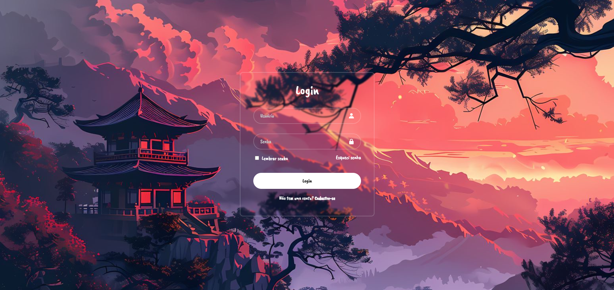

# ⛩️ Projeto: Tela de Login - Anime Aesthetic

Este é um projeto desenvolvido para praticar a criação de interfaces estilizadas e formulários de acesso. Trata-se de uma tela de login com temática oriental/anime, focada em entregar uma experiência visual imersiva utilizando efeitos modernos de CSS como transparência e desfoque (*Glassmorphism*).

📝 **Sobre o Projeto**

O objetivo deste projeto foi aplicar conceitos de estilização avançada de formulários e centralização de elementos na tela. Através dele, trabalhei a construção de um painel semitransparente sobreposto a um background ilustrativo vibrante, garantindo contraste, legibilidade e uma boa usabilidade (*UI/UX*).

🛠 **Tecnologias Utilizadas**

* **HTML5:** Utilizado para a estrutura semântica do formulário de autenticação, incluindo campos de entrada (*inputs*), ícones, *checkbox* e botões.
* **CSS3:** Aplicado para a estilização visual, efeito de vidro (*Glassmorphism/backdrop-filter*), alinhamento ao centro e responsividade.

🚀 **O que eu pratiquei:**

* Construção e estilização de formulários de login (`input`, `placeholder`, `checkbox`).
* Aplicação do efeito *Glassmorphism* (fundo semitransparente com desfoque).
* Centralização absoluta e layout com Flexbox.
* Inclusão e alinhamento de ícones dentro dos campos de entrada.
* Manipulação de imagens de fundo em alta resolução (`background-size: cover`).

🔗 **Veja o projeto na prática**

Você pode acessar a tela de login rodando diretamente no seu navegador através do link abaixo:
https://ricardo-viniicius.github.io/p-gina-de-login-simples/
[https://ricardo-viniicius.github.io/tela-de-login/](https:/www.google.com/search?q=https://ricardo-viniicius.github.io/tela-de-login/) *(ajuste o link conforme o seu repositório)*
